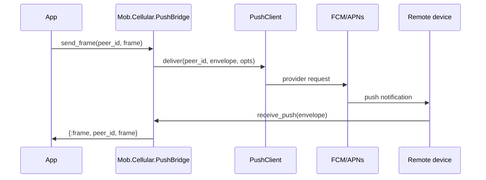

# mob_cellular

Cellular fallback transport plugin for the `mob` ecosystem.

`mob_cellular` provides a last-resort transport for devices that cannot reach
each other over BLE, WiFi, or mesh. The initial bridge uses small push
notification envelopes over FCM/APNs and delegates provider-specific delivery
to an injected push client.

## Carrier Decision

The primary carrier is `:push`.

Push notifications are the initial carrier because they are battery efficient,
work in the background, and are already mediated by the mobile operating
systems. SMS is recognized in the manifest as a future fallback only; the
initial bridge does not send SMS.

## Configuration

```elixir
config :mob_cellular, config: [
  carrier: :push,
  push_providers: [:fcm, :apns],
  max_payload_bytes: 3500,
  log_level: :info
]
```

Unknown keys are tolerated for forward compatibility. Unsupported carriers
raise `Mob.Cellular.CarrierRejectedError`.

## Transport Usage

`Mob.Cellular.bridge_module/0` returns `Mob.Cellular.PushBridge`, which
implements `Mob.Transport`.

```elixir
{:ok, cellular} =
  Mob.Transport.Adapter.start_link(
    transport: Mob.Cellular.bridge_module(),
    event_target: self(),
    transport_opts: [
      push_client: MyApp.PushClient,
      config: Application.get_env(:mob_cellular, :config, [])
    ]
  )

:ok = Mob.Transport.Adapter.send_frame(cellular, "peer-id", "payload")
```

Broadcast delivery reports each recipient independently:

```elixir
{:ok, %{"peer-a" => :ok, "peer-b" => {:error, :provider_rejected}}} =
  Mob.Cellular.PushBridge.broadcast_frame(bridge, "payload",
    recipients: ["peer-a", "peer-b"],
    max_concurrency: 8
  )
```

The push client must implement:

```elixir
def deliver(peer_id, envelope, opts) do
  # Send `envelope` through FCM/APNs for `peer_id`.
end
```

A minimal FCM-style client can keep all credentials in the host app:

```elixir
defmodule MyApp.FcmPushClient do
  def deliver(peer_id, envelope, opts) do
    token = MyApp.DeviceRegistry.push_token!(peer_id)

    body = %{
      message: %{
        token: token,
        data: %{
          "mob_cellular" => JSON.encode!(envelope)
        },
        android: %{
          priority: Keyword.get(opts, :priority, "high"),
          ttl: Keyword.get(opts, :ttl, "30s"),
          collapse_key: Keyword.get(opts, :collapse_key)
        }
      }
    }

    Req.post(
      "https://fcm.googleapis.com/v1/projects/#{MyApp.Firebase.project_id()}/messages:send",
      json: body,
      auth: {:bearer, MyApp.Firebase.access_token!()}
    )
    |> case do
      {:ok, %{status: status}} when status in 200..299 -> :ok
      {:ok, response} -> {:error, {:fcm_rejected, response.status}}
      {:error, reason} -> {:error, reason}
    end
  end
end
```

Inbound push payloads should be delivered to the bridge process with
`Mob.Cellular.PushBridge.receive_push/2`. Decoded frames are emitted as
canonical `Mob.Transport` events.



## Observability

The bridge emits Telemetry events:

- `[:mob, :cellular, :send_frame]` with `:duration` and `:payload_size`
- `[:mob, :cellular, :receive_push]` with `:duration` and `:payload_size`
- `[:mob, :cellular, :error]` with `:operation` and `:reason`

Payload budgets are measured against the JSON-encoded envelope size via
`Mob.Cellular.PushBridge.serialized_size/1`. Provider wrappers may add their
own overhead.

## Assumptions

- Higher layers own encryption, authentication, deduplication, replay handling,
  and large-payload fetch.
- `mob_cellular` owns only the fallback transport envelope and provider handoff.
- Push credentials and provider-specific SDKs stay in the host application's
  injected `push_client`.

## Limits

- Latency can be seconds or longer.
- Payloads must stay small; large frames should be handled by a higher-level
  store-and-fetch protocol.
- Payloads traverse Google or Apple push infrastructure.
- Constant polling is out of scope; this transport is push-based.
